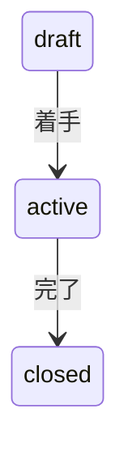

# ローカルIssue運用

各プロジェクトの`docs/issues`をIssue本文の正本とする。GitHub Issuesは使用せず、1ファイルを1 IssueとしてGitで管理する。

この文書は人間が読む運用規約とCLIリファレンスの正本である。AIエージェント固有の選択・スコープ判断は`SKILL.md`、状態遷移と構造検証は`../scripts/issues.js`、Issue本文の形式は`../templates/issue.md`をそれぞれ正本とする。

プロジェクトは`docs/issues/config.json`に次の設定を持つ。`id_prefix`以外の運用差分は設けない。

```json
{
  "id_prefix": "PROJECT"
}
```

スキル自身の構文とCLI契約を確認する場合は、プロジェクトのnpm scriptやテストランナーを使わず、次をスキルディレクトリから直接実行する。

```sh
node --check .agents/skills/manage-local-issues/scripts/issues.js
node .agents/skills/manage-local-issues/scripts/issues.test.js
```

Issue運用の正本はこのスキル内のCLIと文書である。プロジェクト側の`package.json`へのnpm script追加、プロジェクトのlint・テストランナーへのスキルテスト登録、`README.md`への規約複製は必須ではない。既存プロジェクトが持つ`npm run issues`や案内READMEは、直接CLIへ委譲する任意の互換・導線アダプターとして残してよいが、新規プロジェクトへ要求しない。

## 原則

- 1 Issue・1ローカルマージ・1意図とする。
- Issue IDとファイル名は作成後に変更しない。
- `active/`のIssueは常に0件または1件とする。
- 状態変更と一覧表示は必ず運用スクリプトを使う。
- Issue作成はスクリプトへ含めない。毎回`.agents/skills/manage-local-issues/templates/issue.md`から作成する。
- Issueの新規起案はユーザーの明示承諾後にのみ行い、承諾前は候補の提示に留める。承諾前の候補を実在するIssueとして扱わない。
- 受け入れ条件をすべて満たすまでIssueを`closed`にしない。
- 品質境界の外にある追加対応は、受け入れ条件・不変条件・実在する経路・既知の障害・外部契約などの根拠なしに、Blocking指摘やIssueのscopeへ追加しない。根拠が確認できる隣接作業も、まず別Issue候補として提示し、ユーザーの明示承諾後にのみ起案する。承諾前の候補を実在するIssueとして扱わない。

## 着手順

`priority`や順位は保存しない。時間が経つと判断根拠が古くなり、新しいIssueとの比較規則も増えるためである。

`depends_on`は先に完了しなければ着手できない関係だけを表す。依存関係を満たすIssueが複数ある場合は、その時点の目的に合うものを選ぶ。複数の意図が同程度に該当するなら、保存済みの順位で推測せず選択者へ確認する。

## ディレクトリ

| パス | 意味 |
| --- | --- |
| `config.json` | プロジェクトのIssue ID prefix |
| `../templates/issue.md` | Issue作成元 |
| `draft/` | 未着手 |
| `active/` | 現在作業中。最大1件 |
| `closed/` | 完了済み |
| `../scripts/issues.js` | 一覧表示と状態遷移を行う唯一のスクリプト |

`draft/`、`active/`、`closed/`は必須の通常ディレクトリであり、`docs/issues`と各状態ディレクトリのシンボリックリンクは許可しない。状態ディレクトリ内ではIssueファイルと空ディレクトリ保持用の`.gitkeep`だけを許可する。不足や不正なエントリはCLIが非0で報告し、状態変更時に自動修復しない。`init`は一時保管庫を完成させてから確定する。`move`は宛先を排他的に作成して更新済み本文を書き、元ファイルを削除する。通常のCLIエラー時は作成した宛先を掃除するが、プロセス中断や同時変更からの自動復旧は保証しない。

## Issueを作成する

Issueの新規起案はユーザーの明示承諾後にのみ行う。候補を見つけても、承諾前は内容と起案理由を提示するだけでファイルを作成せず、実在するIssueとして扱わない。承諾後に次を行う。

1. `.agents/skills/manage-local-issues/templates/issue.md`を`draft/PROJECT-NNN-short-description.md`へコピーする。
2. 未使用の連番IDをファイル名とfront matterの`id`へ設定する。
3. 問題、意図、受け入れ条件、対象外、依存Issueを記入し、`レビュー指摘`を`未レビュー`で初期化する。`設計判断`はテンプレートの空セクションを残し、Issue起案時には記入しない。
4. 一覧コマンドを実行し、形式とIDの重複がないことを確認する。

Issue作成は、問題と意図を人が明示する工程なので自動化しない。

## Issue内の設計判断を記録する

Issueの`設計判断`は、1つのIssueの実装を進める中で確定した局所的な選択を記録する。起案時の予定、仮説、採用するつもりの案を確定判断として先に書かない。後から実装理由を追跡できるよう、採用した決定、判断に影響した制約・不変条件・検証結果、実際に検討した採用可能な却下案、必要なら再検討条件を残す。候補を網羅した比較表や、実装手順の逐次記録は要求しない。

設計判断のライフサイクルは次のとおりとする。

- `draft`: セクションは空のままにする。制約、確認箇所、未確定事項は`実装メモ`へ記録する
- `active`: 調査、実装、レビューの過程で選択が確定した時点で`設計判断`を記入または更新する
- `closed`: 作業中に判断が生まれた場合は最終状態を記録する。判断が生まれなかった場合は空のままにする

`実装メモ`には制約、確認箇所、未確定事項を置き、確定した選択とその理由を重複して書かない。`レビュー指摘`にはレビューで判明した根本原因、対応判断、検証結果、再発防止策を記録し、`完了記録`には最終的な変更内容と検証結果を記録する。判断が作業中に変わった場合は、コード変更に追随して`設計判断`を最終状態へ更新する。

次のような判断はIssue内に閉じず、IssueからADRへリンクしてADRを正本にする。

- 複数のIssueやモジュールの境界に再利用される
- 公開API契約、データ移行、認証・認可、セキュリティ、配備や運用の不変条件へ影響する
- 既存のADRを変更する、または変更コストが高く長期間維持する必要がある

Issue内の判断を後から横断的な設計判断へ昇格する場合は、既存ADRを書き換えず新しいADRを作成し、Issueと相互にリンクする。設計判断の記録導入前に`closed`となったIssueへは遡及適用しない。

新しいプロジェクトのIssue保管場所だけを作る場合は、リポジトリルートで次を実行する。既存の`docs/issues`がある場合は上書きせず失敗する。

```sh
node .agents/skills/manage-local-issues/scripts/issues.js init PROJECT
```

## 一覧を表示する

通常の作業確認用に、`active` と `draft` をID順のMarkdownテーブルで表示する。`closed` は件数だけを表示する。

```sh
node .agents/skills/manage-local-issues/scripts/issues.js list
```

全件を表示する場合は `all` を指定する。

```sh
node .agents/skills/manage-local-issues/scripts/issues.js list all
```

状態を指定すると対象状態だけに絞り込める。

```sh
node .agents/skills/manage-local-issues/scripts/issues.js list draft
node .agents/skills/manage-local-issues/scripts/issues.js list active
node .agents/skills/manage-local-issues/scripts/issues.js list closed
```

一覧表示時に、front matter、配置ディレクトリ、ID重複、依存Issue、`active`件数も検証する。不整合があれば一覧を部分表示せず非0で終了する。

## 小さく問い合わせる

現在の状態概要だけを確認する場合は`summary`を使う。`active`、`draft`、`closed`の件数と、存在する場合は現在のactive Issue IDを表示する。

```sh
node .agents/skills/manage-local-issues/scripts/issues.js summary
```

着手可能なdraftだけを確認する場合は`ready`を使う。未完了依存のない`draft` IssueだけをID順に表示する。推薦や順位付けは行わない。

```sh
node .agents/skills/manage-local-issues/scripts/issues.js ready
```

特定Issueの詳細を確認する場合は`show`へIssue IDを指定する。状態、タイトル、依存、ファイルパス、本文を表示する。

```sh
node .agents/skills/manage-local-issues/scripts/issues.js show PROJECT-001
```

これらの問い合わせ時も、front matter、配置ディレクトリ、ID重複、依存Issue、`active`件数を全Issueに対して検証する。不整合があれば部分表示せず非0で終了する。

## 状態を変更する

```sh
node .agents/skills/manage-local-issues/scripts/issues.js move PROJECT-001 active
node .agents/skills/manage-local-issues/scripts/issues.js move PROJECT-001 closed
```

許可する遷移は次のとおり。



`move`で許可する状態遷移は`draft`→`active`と`active`→`closed`だけである。`active`→`draft`、`closed`→`draft`、その他の逆方向・スキップ・同一状態への遷移は明確なエラーとして拒否する。着手後の作業を中断する場合もIssueを`active`に留める。完了後に追加作業が必要になった場合は、新しいIssueのdraft候補を提示し、ユーザーの明示承諾後に起案する。

`closed` Issue本文に残る旧運用の記述は、そのIssueの履歴を保持するためのものであり、現行の状態遷移契約を定義しない。現行契約はこの文書とCLIに従い、既存`closed` Issueの本文や状態を遡及変更しない。

次の場合はファイルを移動せず非0で終了する。

- IDまたは状態が不正
- Issueが存在しない、または重複している
- 許可されていない状態遷移
- 別のIssueがすでに`active`
- `closed`になっていない依存Issueがある状態で`active`へ移動
- 未完了の受け入れ条件`- [ ]`がある状態で`closed`へ移動

## ブランチと完了

ブランチ名とコミットにはIssue IDを含める。例：`issue/PROJECT-001-store-initialization`。

Issue作業は`main`からIssueブランチを作成して進める。

```sh
git switch main
git switch -c issue/PROJECT-001-store-initialization
```

### 未実装Issueを撤回する

設計変更によってdraft Issueを実装しない場合は、元の問題、意図、受け入れ条件を「当初の提案（未実装）」節へ移し、各項目が未実装であることを明示する。
現在の本文は、撤回後の問題、意図、受け入れ条件、対象外、実装メモ、設計判断、レビュー指摘、完了記録へ組み替える。
元の受け入れ条件は完了済みの`- [x]`へ変換せず、`- （未実装）`のように未実装であることを示す形式で保存する。
撤回したIssueも通常の`draft`→`active`→`closed`を通し、現在の本文にある撤回後の受け入れ条件と検証記録だけを完了条件として確認する。
この運用はCLIの未完了条件検査を例外扱いにせず、draftからclosedへスキップする操作や例外オプションも追加しない。

## レビュー指摘を記録する

`レビュー指摘`はレビュー全文や修正履歴ではなく、後から共通知識と再発防止策を抽出するための記録である。レビューを実施するまでは`- 未レビュー`とし、指摘を受けた時点で内容を更新する。レビュー済みで指摘がなければ`- 指摘なし`と記録する。

記録は同じ根本原因ごとに1項目へまとめ、1項目をおおむね2〜4文にする。各項目には次を含める。

- 指摘で判明した事実、破られる不変条件、または利用者・運用への影響
- 対応、非対応、対象外への分離のいずれを選んだかと、その判断根拠・検証結果
- 類似箇所の確認結果と、必要ならユーザー承諾後に起案したfollow-up Issue（承諾前は候補）やプロジェクトで定めた再発防止記録など、再発防止策への行き先

同じ根本原因から追加指摘が出た場合は項目を増やさず、既存項目へ不足していた観点と水平確認結果を追記する。単独の表記修正、機械的なlint修正、生のレビュー全文、コマンド出力は、それ自体が再発防止の判断材料にならない限り記録しない。受け入れ条件と混同しないよう、レビュー指摘にはチェックボックスを使わない。

この運用の導入前に`closed`となったIssueへは遡及適用しない。`closed` Issueの再オープンや状態の巻き戻しは行わない。追加作業が必要になった場合は、新しいIssueのdraft候補を提示し、ユーザーの明示承諾後に起案して追跡する。

完了時は受け入れ条件をチェックし、`完了記録`へ変更内容、検証結果、レビュー観点を記載してから`closed`へ移動する。設計や操作方法が変わった場合は、同じIssueブランチで関連ドキュメントも更新する。

マージ承諾前はIssueを`active`に留める。承諾後はIssue branch上でIssueを`closed`へ移動し、その変更をコミットしてから、`main`へ`--no-ff`でマージする。

レビューを実施した場合は、完了前に`レビュー指摘`がレビュー結果と対応判断を反映していることを確認する。複数回レビューした場合も、時系列の逐次記録ではなく最終的に得られた根本原因と再発防止策が読める状態に整える。

`完了記録`はローカルPRの代替記録である。少なくとも次を残す。

- 変更: 実装上の主要な変更点
- 検証: 実行したコマンドと手動確認
- レビュー観点: マージ前に特に見るべき影響範囲

## ローカルレビューとマージ

GitHub PRはこの運用では使用しない。マージ前にローカルで差分、コミット、検証結果を確認する。

```sh
git diff main...issue/PROJECT-001-store-initialization
git log --oneline main..issue/PROJECT-001-store-initialization
node .agents/skills/manage-local-issues/scripts/issues.js list
```

プロジェクト固有の実装検証コマンドも、変更範囲に応じてこの確認へ含める。確認後、`main`へ`--no-ff`でマージする。Issueごとのまとまりを履歴へ残すため、squash mergeは標準手順にしない。

```sh
git switch main
git merge --no-ff issue/PROJECT-001-store-initialization
git push origin main
```

Issueブランチ内の個別コミットハッシュやマージコミットハッシュは`完了記録`へ記録しない。`--no-ff`の履歴からIssueブランチ、個別コミット、前後の取り込み関係を追跡する。
